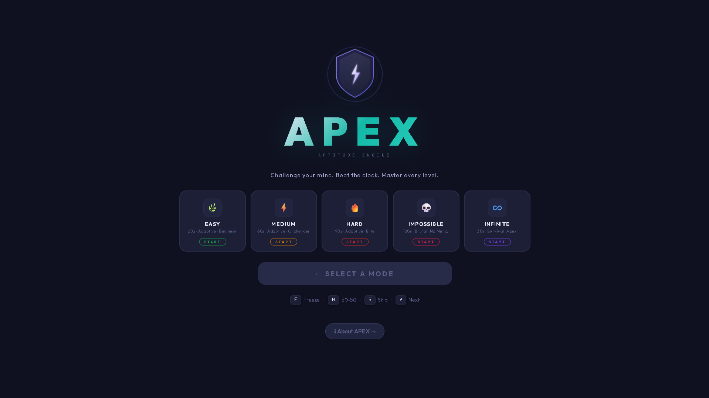
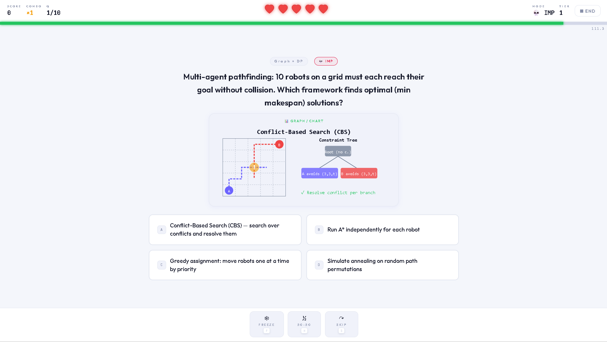
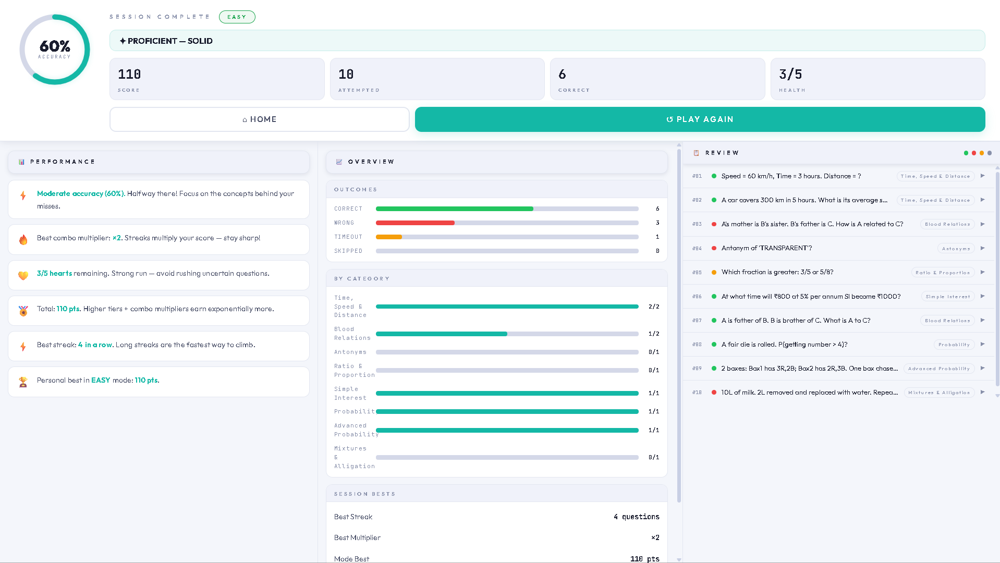

<div align="center">


<br/>

[](https://rahulnag-v.github.io/APEX--AptitudeChallengeEngine.github.io/index.html)
[](https://github.com/RahulNag-V/APEX--AptitudeChallengeEngine.github.io/stargazers)
[](LICENSE)
[](https://developer.mozilla.org/en-US/docs/Web/HTML)
[](https://developer.mozilla.org/en-US/docs/Web/CSS)
[](https://developer.mozilla.org/en-US/docs/Web/JavaScript)

<br/>

> ### ⚡ A blazing-fast, feature-packed aptitude quiz game built with pure HTML, CSS & Vanilla JS.
> ### No frameworks. No dependencies. Just raw performance.

<br/>

</div>

---

## 🌟 What is APEX?

**APEX** *(Aptitude Performance & Excellence eXperience)* is a full-featured, browser-based quiz game designed to sharpen your quantitative aptitude and logical reasoning skills. Whether you're prepping for placement exams, competitive tests, or just love a good brain workout — APEX delivers it with style.

Think of it as your personal aptitude dojo — complete with combo multipliers, power-ups, particle explosions, and a robust stats dashboard.

---
## 📸 Screenshots

---

### 🏠 Home Screen — Choose Your Battleground

<p align="center">
  
</p>

<p align="center">
  <em>Five difficulty modes, each with its own personality. Pick your poison.</em>
</p>

---

### ⚔️ Game Screen — Fight Every Second

<p align="center">
  
</p>

<p align="center">
  <em>Combo streaks, countdown timers, power-ups, and SVG diagrams — all in the heat of battle.</em>
</p>

---

### 📊 Results Screen — Know Your Numbers

<div align="center">
  
  <br/><br/>
  <p><em>Full session breakdown — accuracy, category heatmap, per-question review, and personal bests.</em></p>
</div>

<br/>

---

## 🎮 Game Modes

| Mode | Description | Difficulty |
|:----:|-------------|:----------:|
| 🟢 **Easy** | Core fundamentals — perfect for warming up | Beginner |
| 🟡 **Medium** | Stepping it up — tests your depth | Intermediate |
| 🔴 **Hard** | Serious challengers only | Advanced |
| 💀 **Impossible** | Elite tier — for the fearless | Expert |
| ♾️ **Infinite** | Endless questions until your hearts run out | Endless |

Each mode features **3 internal tiers (T1 → T2 → T3)** that progressively unlock as you perform better, creating a smooth difficulty ramp within a single session.

---

## ✨ Features

### 🧠 Question Bank

- **500+ handcrafted questions** spanning all 5 modes (165 per standard mode across 3 tiers of 55 each)
- Topics covered:
  - Number Series · Percentages · Profit & Loss · Ratio & Proportions
  - Averages · SI & CI · Time & Work · Time-Speed-Distance
  - Clocks · Coding-Decoding · Blood Relations · Syllogisms
  - Data Interpretation · Verbal Reasoning · and more
- Every question includes a **step-by-step SVG explanation diagram**

### ⚔️ Combat Mechanics

- **❤️ 5 Hearts** — every 2 wrong answers costs you a heart
- **🔥 Combo Multiplier** — consecutive correct answers stack a streak bonus for extra points
- **⏱️ Countdown Timer** — time limits tighten with each difficulty tier
- **Score formula** factors in: accuracy × speed × combo × difficulty tier

### 🪄 Power-Ups *(3 of each per game)*

| Power-Up | Keyboard Shortcut | Effect |
|:--------:|:-----------------:|--------|
| ❄️ **Freeze** | `F` | Pauses the timer for 5 seconds with a snowfall animation |
| ✂️ **50-50** | `H` | Eliminates 2 incorrect answer options |
| ⏭️ **Skip** | `S` | Skips the current question with zero penalty |

### 🎆 Visual Effects Engine

- **Particle explosion system** — Canvas-based confetti burst on correct answers
- **Snowflake canvas** — Crystalline snowfall when Freeze power-up activates
- **Screen flash & shockwave** — Animated overlays triggered on game end
- **Next-question warp** — Smooth transition overlay between questions
- **Combo celebration effects** — Glowing bursts at streak milestones

### 📊 Stats & Profile System

- **Persistent `localStorage`** — your stats survive page reloads
- **Accuracy trend chart** — Canvas-drawn line graph of your last 10 sessions
- **Best score per mode** — individually tracked for each difficulty
- **Session history** — chronological log of recent games
- **All-time stats** — total games played, best score, average accuracy, best streak

### 🎨 Theming

- **Light & Dark mode** — full theme toggle via CSS variable system
- **Per-mode glow themes** — each difficulty has its own accent palette
- **Smooth transitions** — every state change is animated

### 🔊 Sound Design

- Toggleable sound effects
- Distinct audio cues for correct answers, wrong answers, timeouts, and power-up usage

---

## 📁 Project Structure

```
apex/
│
├── index.html          # Main game shell & all screen layouts
├── about.html          # About / credits page
├── style.css           # Full design system (tokens, themes, components)
│
├── script.js           # 🧠 Core game engine (v5.0)
│                       #    ├─ ParticleSystem
│                       #    ├─ SnowSystem
│                       #    ├─ AnimFX
│                       #    ├─ SoundEngine
│                       #    ├─ GameState & Logic
│                       #    ├─ Timer & Combo Tracker
│                       #    └─ Stats / localStorage persistence
│
├── easy.js             # 🟢 Easy question bank   (165 questions, 3 tiers)
├── medium.js           # 🟡 Medium question bank (165 questions, 3 tiers)
├── hard.js             # 🔴 Hard question bank   (165 questions, 3 tiers)
├── impossible.js       # 💀 Impossible question bank
└── infinite.js         # ♾️  Infinite mode question bank
```

---

## 🕹️ How to Play

1. **Choose a mode** from the home screen (Easy → Impossible → Infinite)
2. **Select question count** (10 / 20 / 30 / 50 for standard modes)
3. **Answer before the timer expires** — faster answers score more points
4. **Build combos** — consecutive correct answers multiply your score
5. **Use power-ups wisely** — you only get 3 of each per game (`F` Freeze · `H` 50-50 · `S` Skip)
6. **Survive** — lose all 5 hearts and the game ends
7. **Review your results** — full breakdown with per-question review, category accuracy, and session bests
8. **Track your progress** via the 📊 Stats tab in settings

---

## 🧰 Tech Stack

| Layer | Technology |
|-------|------------|
| Markup | HTML5 (semantic, accessible) |
| Styling | CSS3 — custom properties, keyframe animations, canvas |
| Logic | Vanilla JavaScript ES6+ (strict mode) |
| Persistence | Web `localStorage` API |
| Charts | HTML5 Canvas (hand-rolled, zero dependencies) |
| Fonts | Outfit + JetBrains Mono (Google Fonts) |

**Zero frameworks. Zero build tools. Zero dependencies.** 🎯

---

## 🗺️ Roadmap

- [ ] Leaderboard with Firebase / Supabase backend
- [ ] Multiplayer challenge mode (real-time via WebSockets)
- [ ] More question categories (Verbal, Logical, DI-heavy)
- [ ] PWA support (offline play, installable)
- [ ] Mobile app wrapper (Capacitor / Tauri)
- [ ] Achievement badges & unlock system
- [ ] Export results as PDF report

---

## 🤝 Contributing

Contributions are welcome!

```bash
# Fork the repo, then:
git checkout -b feature/your-feature-name
git commit -m "feat: add awesome feature"
git push origin feature/your-feature-name
# Open a Pull Request 🎉
```

To add questions, follow the existing structure in any `*.js` question bank file. Each question requires the following fields:

```js
{
  q:    "Question text",
  opts: ["Option A", "Option B", "Option C", "Option D"],
  ans:  "Option A",          // must match one of opts exactly
  cat:  "Category Name",
  exp:  "Step-by-step HTML explanation",
  image: { type: "svg", src: `<svg>...</svg>` }  // optional
}
```

---

## 📜 License

This project is licensed under the **MIT License** — see [LICENSE](LICENSE) for details.

---

<div align="center">

### If APEX helped you ace your exam or just made your brain sweat — drop a ⭐

<br/>

*Built with ❤️ and a lot of caffeine.*


</div>
